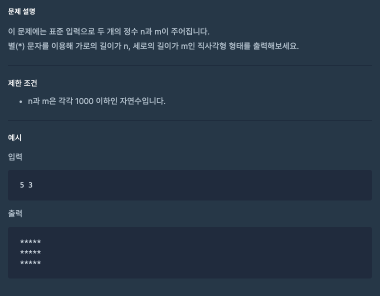

## 자바스크립트 알고리즘(프로그래머스)

<br>

## 목표 🙌🏻

- README.md 파일에 사진과 코드를 기록으로 남기고, 다른 사람들의 코드도 분석하며, 알고리즘 실력을 향상시킨다.
- 클린 코딩을 생활화하고, 깊이 있는 학습을 목표한다.

<br>

## 준수사항 ❗️

- 배열의 고차함수를 적극적으로 사용하며, 메모리의 사용을 최소화한다.
- 문제 설명과 제한 조건이 기록된 이미지 파일을 같이 첨부하고, 코드 또한 README.md 파일에 기록한다.

<br>

## 1. 1단계 문제

<br>

### 1-1. 별찍기

<br>



```javascript
process.stdin.setEncoding('utf8');
process.stdin.on('data', (data) => {
	const n = data.split(' ');
	const a = Number(n[0]);
	const b = Number(n[1]);

	console.log(`${'*'.repeat(a)} \n`.repeat(b));
});
```

<br>

### 1-2. x만큼 간격이 있는 n숫자

<br>


```javascript
function solution(x, n) {
	return new Array(n).fill(0).map((_, index) => x * (index + 1));
}
```

<br>

### 1-3. 행렬의 덧셈

<br>


```javascript
function solution(arr1, arr2) {
	return arr1.map((arr, index01) => arr.map((value, index02) => value + arr2[index01][index02]));
}
```

<br>

### 1-4. 핸드폰 번호 가리기

<br>


```javascript
function solution(phoneNumber) {
	return phoneNumber.split('').map((str, index) => (phoneNumber.length - index > 4 ? '*' : str)).join('');
}

function solution(phoneNumber) {
	return '*'.repeat(phoneNumber.length - 4) + phoneNumber.slice(phoneNumber.length - 4, phoneNumber.length);
}
```
