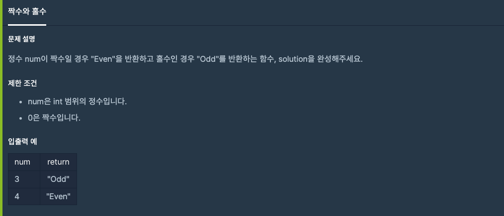

## 자바스크립트 알고리즘(프로그래머스)

<br>

## 목표 🙌🏻

- README.md 파일에 사진과 코드를 기록으로 남기고, 다른 사람들의 코드도 분석하며, 알고리즘 실력을 향상시킨다.
- 클린 코딩을 생활화하고, 깊이 있는 학습을 목표한다.

<br>

## 준수사항 ❗️

- 배열의 고차함수를 적극적으로 사용하며, 메모리의 사용을 최소화한다.
- 문제 설명과 제한 조건이 기록된 이미지 파일을 같이 첨부하고, 코드 또한 README.md 파일에 기록한다.

<br>

## 1. 1단계 문제

<br>

### 1-1. 별찍기

<br>


```javascript
process.stdin.setEncoding('utf8');
process.stdin.on('data', data => {
	const n = data.split(' ');
	const a = Number(n[0]);
	const b = Number(n[1]);

	console.log(`${'*'.repeat(a)} \n`.repeat(b));
});
```

<br>

### 1-2. x만큼 간격이 있는 n숫자

<br>


```javascript
function solution(x, n) {
	return new Array(n).fill(0).map((_, index) => x * (index + 1));
}
```

<br>

### 1-3. 행렬의 덧셈

<br>


```javascript
function solution(arr1, arr2) {
	return arr1.map((arr, index01) => arr.map((value, index02) => value + arr2[index01][index02]));
}
```

<br>

### 1-4. 핸드폰 번호 가리기

<br>


```javascript
function solution(phoneNumber) {
	return phoneNumber
		.split('')
		.map((str, index) => (phoneNumber.length - index > 4 ? '*' : str))
		.join('');
}

function solution(phoneNumber) {
	return '*'.repeat(phoneNumber.length - 4) + phoneNumber.slice(phoneNumber.length - 4, phoneNumber.length);
}
```

### 1-5. 하샤드 수

<br>


```javascript
function solution(x) {
	return (
		x %
			x
				.toString()
				.split('')
				.reduce((pre, cur) => pre + parseInt(cur), 0) ===
		0
	);
}
```

### 1-6. 평균 구하기

<br>


```javascript
function solution(arr) {
	return arr.reduce((pre, cur) => pre + cur, 0) / arr.length;
}
```

### 1-7. 콜라츠 추측

<br>


```javascript
function solution(argNum) {
	let numCount = 0;
	while (argNum != 1) {
		if (numCount >= 500) {
			break;
		}
		(argNum % 2 == 1 && (argNum = argNum * 3 + 1)) || (argNum % 2 == 0 && (argNum = argNum / 2));
		numCount++;
	}
	return argNum == 1 ? numCount : -1;
}
```

### 1-8. 최대공약수와 최소 공배수

<br>


```javascript
function solution(a, b) {
	var greatestCommonDivisor = getGreatestCommonDivisor(a, b);
	var lcm = (a * b) / greatestCommonDivisor;

	return [greatestCommonDivisor, lcm];
}

function getGreatestCommonDivisor(a, b) {
	if (b == 0) return a;
	return a > b ? getGreatestCommonDivisor(b, a % b) : getGreatestCommonDivisor(a, b % a);
}
```

### 1-9. 짝수와 홀수

<br>



```javascript
function solution(num) {
	return num % 2 ? 'Odd' : 'Even';
}
```

### 1-10. 제일 작은 수 제거하기

<br>


```javascript
function solution(arr) {
	return arr.length === 1 ? [-1] : arr.filter(num => num != Math.min(...arr));
}
```

### 1-11. 정수 제곱근 판별

<br>


```javascript
function solution(n) {
	return Math.sqrt(n) == parseInt(Math.sqrt(n)) ? Math.pow(Math.sqrt(n) + 1, 2) : -1;
}
```

### 1-12. 정수 내림차순으로 배치하기

<br>


```javascript
function solution(numArg) {
	return +String(numArg)
		.split('')
		.sort((a, b) => b - a)
		.join('');
}
```

### 1-13. 자연수 뒤집어 배열로 만들기

<br>


```javascript
function solution(n) {
	return n
		.toString()
		.split('')
		.reverse()
		.map(num => +num);
}
```

### 1-14. 자릿수 더하기

<br>


```javascript
function solution(n) {
	return n
		.toString()
		.split('')
		.map(num => +num)
		.reduce((pre, cur) => pre + cur, 0);
}
```

### 1-15. 이상한 문자 만들기

<br>


```javascript
function solution(s) {
	return s
		.split(' ')
		.map(str =>
			str
				.split('')
				.map((spell, index) => (index % 2 ? spell.toLowerCase() : spell.toUpperCase()))
				.join('')
		)
		.join(' ');
}
```

### 1-16. 약수의 합

<br>


```javascript
function solution(n) {
	let result = 0;
	for (let i = 1; i <= Math.sqrt(n); i++) {
		for (let j = n; j >= Math.sqrt(n); j--) {
			(i * j == n && i != j && (result += i + j)) || (i * j == n && i == j && (result += i));
		}
	}
	return result;
}

function solution(n) {
	let result = 0;
	for (let i = 1; i <= n; i++) {
		n % i === 0 && (result += i);
	}
	return result;
}
```

### 1-17. 문자열을 정수로 만들기

<br>


```javascript
function solution(s) {
	return +s;
}
```

### 1-18. 수박수박수박수박수박수?

<br>


```javascript
function solution(n) {
	let result = '';
	for (let i = 0; i < n; i++) {
		result += i % 2 ? '박' : '수';
	}
	return result;
}
```

### 1-19. 서울에서 김서방 찾기

<br>


```javascript
function solution(seoul) {
	return `김서방은 ${seoul.findIndex(str => str === 'Kim')}에 있다`;
}
```

### 1-20. 문자열 다루기 기본

<br>


```javascript
function solution(s) {
	return /^\d{4}$|^\d{6}$/.test(s);
}
```

### 1-21. 문자열 내림차순으로 배치하기

<br>


```javascript
function solution(s) {
	const upper = s
		.split('')
		.filter(str => /[A-Z]/.test(str))
		.sort((a, b) => b.charCodeAt() - a.charCodeAt())
		.join('');
	const lower = s
		.split('')
		.filter(str => /[a-z]/.test(str))
		.sort((a, b) => b.charCodeAt() - a.charCodeAt())
		.join('');
	return lower + upper;
}
```

### 1-22. 문자열 내 p와 y의 개수

<br>


```javascript
function solution(s) {
	return (s.match(/p/gi) || []).length == (s.match(/y/gi) || []).length;
}
```

### 1-23. 두 정수 사이의 합

<br>


```javascript
function solution(a, b, i = -1) {
	return Array(Math.abs(b - a) + 1)
		.fill(a > b ? b : a)
		.map((num, index) => num + index)
		.reduce((pre, cur) => pre + cur, 0);
}
```

### 1-24. 나누어 떨어지는 숫자 배열

<br>


```javascript
function solution(arr, divisor) {
	return arr.filter(num => num % divisor == 0).length ? arr.filter(num => num % divisor == 0).sort((a, b) => a - b) : [-1];
}
```

### 1-25. 예산

<br>


```javascript
function solution(d, budget) {
	return d
		.sort((a, b) => a - b)
		.filter(num => {
			budget = budget - num;
			return budget >= 0;
		}).length;
}
```

### 1-26. 부족한 금액 계산하기

<br>


```javascript
function solution(price, money, count) {
	let i = 1;
	let num = 0;
	while (i <= count) {
		num += price * i;
		i++;
	}
	return money - num > 0 ? 0 : Math.abs(money - num);
}
```

### 1-27. 나머지가 1이 되는 수 찾기

<br>


```javascript
function solution(n) {
	for (let x = 2; ; x++) {
		if (n % x === 1) return x;
	}
}
```

### 1-28. K번째 수

<br>


```javascript
function solution() {
	return commands.map(arr => array.slice(arr[0] - 1, arr[1]).sort((a, b) => a - b)[arr[2] - 1]);
}
```

### 1-29. 2016년

<br>


```javascript
function solution(a, b) {
	const days = ['SUN', 'MON', 'TUE', 'WED', 'THU', 'FRI', 'SAT'];
	const date = new Date(`2016/${a}/${b}`);
	return days[date.getDay()];
}
```

### 1-30. 음양 더하기

<br>


```javascript
function solution(absolutes, signs) {
	return absolutes.map((num, index) => (signs[index] ? num : -num)).reduce((pre, cur) => pre + cur, 0);
}
```

### 1-31. 없는 숫자 더하기

<br>


```javascript
function solution(numbers) {
	return 45 - numbers.reduce((pre, cur) => pre + cur, 0);
}
```

### 1-32. 완주하지 못한 선수

<br>


```javascript
function solution(participant, completion) {
	participant = participant.sort();
	completion = completion.sort();

	for (let i = 0; i < participant.length; i++) {
		if (participant[i] !== completion[i]) return participant[i];
	}
}
```
